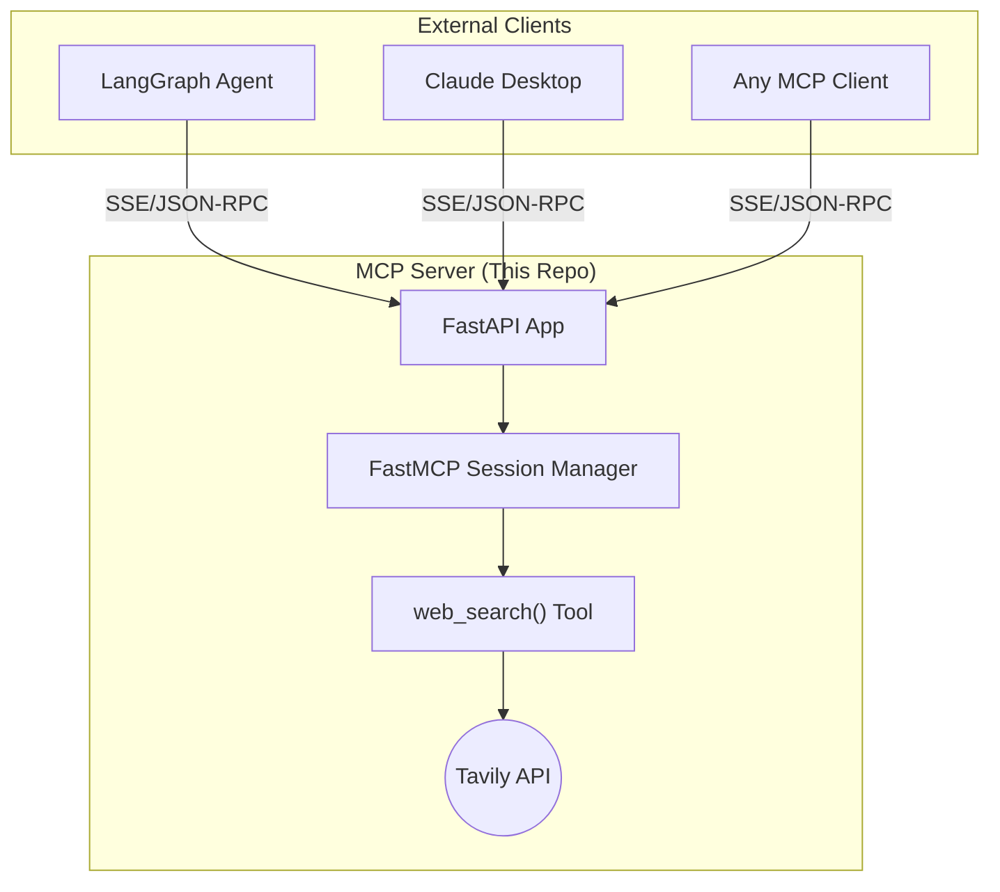

# MCP Tool Server (Tavily Search) 🔧


The **Server-Side component** of the Decoupled Research Agent architecture. This lightweight FastAPI server exposes the Tavily Search API as a standardized **Model Context Protocol (MCP)** tool, allowing remote AI agents to perform web searches without holding API credentials.

> **Note:** This server is designed to work in tandem with the [Tavily Client](https://github.com/danielecelsa/chatbot-with-search/README.md). Together, they demonstrate a secure, decoupled microservices architecture for Agentic AI.

---

## 🚀 Key Features

### 1. MCP-Compliant Tool Exposure
Implements the [Model Context Protocol](https://modelcontextprotocol.io/) standard using `FastMCP`, allowing any MCP-compatible client to discover and invoke the `web_search` tool dynamically.

### 2. Secure Credential Isolation
The Tavily API key is stored **only on the server**. The client agent never sees or handles sensitive credentials, simulating enterprise-grade separation of concerns.

### 3. Structured Response Format
The `web_search` tool returns a clean JSON payload containing:
*   **`answer`:** A pre-generated summary from Tavily's AI.
*   **`results`:** A list of source objects with `title`, `url`, and `content` (truncated to 2000 chars for token efficiency).

### 4. Stateless HTTP Transport
Uses `streamable_http` transport (SSE over HTTP), enabling deployment on serverless platforms like Render, Railway, or Hugging Face Spaces without sticky sessions.

---

## 🛠️ Architecture



---

## 🔧 Tech Stack

*   **Framework:** FastAPI + Uvicorn
*   **MCP SDK:** `mcp` (Python SDK with `FastMCP` wrapper)
*   **Search Engine:** Tavily Python Client
*   **Transport:** Streamable HTTP (SSE)

---

## ⚙️ Tool Specification

### `web_search(query: str) -> str`

| Parameter | Type | Description |
|-----------|------|-------------|
| `query` | `str` | The search query to execute |

**Returns:** A JSON string with the following structure:

```json
{
  "answer": "A concise AI-generated summary of the search results.",
  "query": "The original query",
  "results": [
    {
      "title": "Page Title",
      "url": "https://source-url.com",
      "content": "Truncated page content (max 2000 chars)..."
    }
  ]
}
```

---

## 📦 Installation & Setup

### Prerequisites
*   Python 3.10+
*   A Tavily API Key ([Get one here](https://tavily.com/))

### 1. Clone the Repository
```bash
git clone https://github.com/danielecelsa/chatbot-with-search.git
cd chatbot-with-search/tavily-server
```

### 2. Install Dependencies
```bash
pip install -r requirements.txt
```

### 3. Configure Environment
Create a `.env` file in this directory:
```env
TAVILY_API_KEY=your_tavily_api_key
```

### 4. Run the Server
```bash
uvicorn server:app --host 0.0.0.0 --port 7860
```

The MCP endpoint will be available at:
```
http://localhost:7860/tav/mcp
```

---

## 🐳 Docker Deployment

```bash
docker build -t mcp-tavily-server .
docker run -p 7860:7860 -e TAVILY_API_KEY=your_key mcp-tavily-server
```

---

## 🧪 Testing the Endpoint

You can test the MCP endpoint using any MCP-compatible client, or manually with `curl`:

```bash
# Health check (FastAPI)
curl http://localhost:7860/

# For MCP tool discovery, use an MCP client library
```

---

## 🔗 Related Components

| Component | Description | Link |
|-----------|-------------|------|
| **Tavily Client** | The LangGraph-based AI agent that consumes this server | [View Client](../tavily-client/README.md) |
| **Live Demo** | Deployed version of the full system | [Launch App](https://chat-w-search.46.224.88.247.nip.io/) |

---

<div align="center">
  <b>Developed by Daniele Celsa</b><br>
  <a href="https://danielecelsa.github.io/portfolio/">View Portfolio</a> • 
  <a href="https://www.linkedin.com/in/domenico-daniele-celsa-518b758b/">LinkedIn</a>
</div>